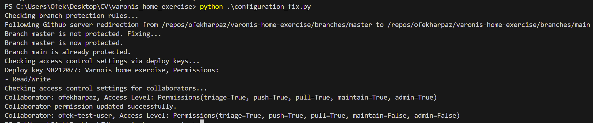
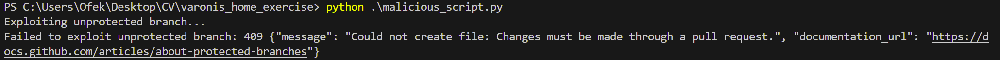

# Table of Contents

- [Branch Protection Rules](#branch-protection-rules)
- [Access Control via Collaborators](#access-control-via-collaborators)
- [Enforce HTTPS for GitHub Pages](#enforce-https-for-github-pages)
- [Code Scanning Alerts](#code-scanning-alerts)
- [Deploy Keys](#deploy-keys)
- [Framework Expansion Strategy](#framework-expansion-strategy)
- [The Python Code](#python-example)
- [Bonus](#bonus)

## 1. Branch Protection Rules: 

**NIST Compliance Category:** Access Control

Branch protection rules define whether collaborators can delete or force push to the branch and set requirements for any pushes to the branch, such as passing status checks or a linear commit history.

Branch protection rules are essential for maintaining the integrity and security of the repository by preventing accidental or unauthorized changes to critical branches.

**Best practices:**

1. **Require Pull Requests:** Enforce the use of pull requests for merging changes into protected branches. Pull requests facilitate code review by allowing collaborators to review proposed changes before merging, helping to catch errors and vulnerabilities early in the development process.

2. **Require Code Reviews:** Mandate that all changes must undergo code review before being merged into protected branches. Code reviews involve peer evaluation of proposed changes to ensure code quality, keeping to coding standards, and identification of potential security issues.

3. **Require Status Checks:** Set up status checks that must pass before a pull request can be merged into protected branches. Status checks can include automated tests, code analysis, and other quality assurance checks to ensure that proposed changes meet predefined criteria before being merged.

4. **Restrict Force Pushes and Deletions:** Prevent collaborators from force pushing or deleting branches in protected branches. Force pushes can overwrite commit history and introduce errors or unintended changes, while deletions can result in loss of code or accidental data loss.

5. **Enforce Linear Commit History:** Require that commits in protected branches maintain a linear commit history, meaning that changes are merged in a sequential order. This helps maintain code integrity and makes it easier to track changes and identify potential issues.

6. **Limit Merge Permissions:** Restrict merge permissions to specific individuals or teams with the necessary authority to approve changes. This helps prevent unauthorized users from merging changes into protected branches and reduces the risk of accidental or malicious modifications.
---

When the branch protection rules are misconfigured or the best practices are not enforced, it can lead to vulnerabilities and risks such as:

1. **Unauthorized Changes:** any collaborator with write access to the repository can make changes directly to critical branches, such as master or main. It may also cause code leaks in extreme cases.

2. **Code Quality Issues:** Lack of mandatory code reviews and status checks can result in poor code quality. Unreviewed changes may contain errors, bugs, or security vulnerabilities that go unnoticed, leading to potential system failures or security breaches.

3. **Data Loss:** Allowing force pushes and deletions without restrictions can lead to data loss or corruption. Accidental force pushes may overwrite commit history, while unauthorized deletions can result in the loss of valuable code or project assets.
---

**Detection:** Check branch protection settings in the repository to identify unprotected branches.

**Automatic Fix:**
When implementing an automatic fix for branch protection rules, the goal is to ensure that critical branches, such as master or main, have appropriate safeguards in place to prevent unauthorized or accidental changes. Here's how the automatic fix process could work:

- Detection of Unprotected Branches:
    The system periodically scans the repository's branch protection settings to identify any branches that are not protected.

- Definition of Protection Rules:
    Define a set of branch protection rules that align with security best practices and the organization's policies. For example, you may require a pull request before merging to enforce code review processes, or you may require status checks to pass before merging to ensure code quality. Additionally, you may restrict force pushes and deletions.

- Automated Application of Protection Rules:
    For each unprotected branch identified, the system automatically applies the defined protection rules. This could involve using the GitHub API to programmatically configure branch protection settings.

- Verification and Monitoring:
    Verify that the protection rules have been successfully applied to the branches. Monitor the repository for any changes to the protection settings or attempts to bypass the rules.

- Notification and Feedback:
    Notify repository administrators about the applied protection rules. Provide feedback on which branches were protected and the specific rules that were enforced.
---

**Relevant MITRE attack techniques:** Command and Scripting Interpreter (T1059), Compromise Accounts (T1078), Code Signing (T1116)

Lets take a look at code signing as an example:
**Code signing** is a process used to inject the attackers code into the repository. Adversaries may attempt to bypass branch protection rules by signing malicious code with legitimate or stolen code signing certificates. By doing so, they can evade detection and gain unauthorized access to protected branches, potentially compromising the integrity and security of the repository. 

For example, an adversary might gain access to a developer's machine or compromise their credentials. They could then use the legitimate code signing certificates available on the compromised system to sign malicious code. 

Steps to mitagate such an attack may include:

1. Two-Factor Authentication (2FA).
2. Regularly Sign Out and Change Passwords.
3. Monitor and alert about suspicious activities, such as multiple failed login attempts or unusual access patterns. 

## 2. Access Control via Collaborators: 
**NIST Compliance Category:** Access Control

Access control settings in GitHub repositories determine who has permission to view, contribute to, and manage the repository's content. Collaborators are users who have been granted specific access rights to the repository, such as read, write, or administrative privileges.

Vulnerability Implications: Misconfigured access control settings can lead to unauthorized access or changes to the repository's codebase, potentially resulting in data breaches, code tampering, or loss of intellectual property.

**Detection:** To detect misconfigured access control settings, you can regularly audit the list of collaborators and their access levels in the repository settings. Look for anomalies such as excessive permissions granted to inactive users or unauthorized individuals.

**Automatic Fix:**

- Develop a script or automated process to periodically audit the access control settings and collaborator permissions in the repository. This script should retrieve and analyze the list of collaborators, their access levels, and any associated permissions.

- Implement logic within the script to detect anomalies or misconfigurations in the access control settings. This could include identifying excessive permissions granted to inactive users, unauthorized individuals added as collaborators, or deviations from established access control policies.

## 3. Enforce HTTPS for GitHub Pages: 
**NIST Compliance Category:** Communications Protection

"Enforce HTTPS for GitHub Pages" is a security setting that ensures GitHub Pages sites are served over HTTPS (Hypertext Transfer Protocol Secure). HTTPS encrypts the communication between the user's browser and the GitHub Pages site, enhancing security by protecting transmitted data from potential eavesdropping or tampering.

**Detection:**
To detect whether "Enforce HTTPS for GitHub Pages" is misconfigured or disabled:

- Navigate to the repository settings for GitHub Pages.
- Check if the option to enforce HTTPS is enabled. If it is disabled or not present, HTTPS enforcement may not be enabled.

**Automatic fix:**

1. Firstly, Authenticate with the GitHub API using a personal access token or OAuth token with the necessary permissions to modify repository settings.
2. Use the GitHub API to fetch information about the repository where GitHub Pages is hosted.
3. Modify the repository settings programmatically using the GitHub API to enable HTTPS enforcement for GitHub Pages. This typically involves making a PATCH request to the GitHub API endpoint for repository settings and updating the relevant configuration option to enforce HTTPS.

## 4. Code Scanning Alerts: 

**NIST Compliance Category:** Assessment, Authorization, and Monitoring

"Code Scanning Alerts" is a feature in GitHub that enables automated code scanning for identifying security vulnerabilities, coding errors, and other potential issues in the codebase. It leverages static code analysis to analyze the source code and detect patterns that may indicate security vulnerabilities or coding mistakes.

There are three main ways to use CodeQL analysis for code scanning:

1. Use default setup to quickly configure CodeQL analysis for code scanning on your repository. Default setup automatically chooses the languages to analyze, query suite to run, and events that trigger scans.

2. Use advanced setup to add the CodeQL workflow to your repository. This generates a customizable workflow file which uses the github/codeql-action to run the CodeQL CLI.

3. Run the CodeQL CLI directly in an external CI system and upload the results to GitHub.

Additonally, you may want to use a third party scanning tool, to allow for further scalability and flexability.
Managing code scanning alerts is done in the "Code Security and Analysis" section of the settings tab.

**Benefits of Code Scanning Alerts:**
- Improved Code Quality: Identify and address coding errors and security vulnerabilities early in the development process, leading to higher-quality code.

- Enhanced Security: Proactively detect and mitigate security risks in the codebase, reducing the likelihood of security breaches or vulnerabilities.

- Risk Mitigation: Mitigate potential risks associated with software development by addressing coding mistakes and vulnerabilities before they manifest into larger issues.

- Compliance Assurance: Ensure compliance with security standards and regulations by continuously monitoring and analyzing the codebase for security vulnerabilities and compliance issues.

## 5. Deploy Keys: 
**NIST Compliance Category:**  Identification and Authentication

Deploy keys are SSH keys that provide read-only or read-write access to a single repository. They are commonly used for automated deployments or accessing private repositories from CI/CD pipelines, servers, or other automated systems. Deploy keys are tied to a single repository and can be added as collaborators, granting them either read-only or read-write access to the repository's contents.

When adding a deploy key, GitHub provides the option to approve write access, allowing the key to make changes to the repository. This feature is useful for scenarios where automated systems need to perform write operations, such as pushing updates or creating branches, as part of the deployment process.

**Detection:**

To determine if deploy keys are configured correctly: Navigate to the repository settings in GitHub.
Check the "Deploy keys" section to see if any keys are configured.
Verify that the configured keys have appropriate permissions, including whether write access is approved or restricted to read-only.

**Automatic Fix if Misconfigured:**

If deploy keys are misconfigured or improperly added:

1. Reconfiguration:
    Check the configured deploy keys to ensure they have the correct permissions and access levels.
    If any keys are added incorrectly or have incorrect permissions, automatically remove or update them to resolve the misconfiguration.

2. Health Checks:
    Implement automated health checks to periodically verify the functionality and responsiveness of configured deploy keys.
    If a deploy key is found to be misconfigured or inactive, automatically attempt to reconfigure or reactivate it to ensure uninterrupted access to the repository.

## Framework Expansion Strategy: 

Expanding our existing scripts into a comprehensive framework for managing misconfigurations across multiple services requires a systematic approach that ensures scalability, flexibility, and maintainability. 

The following strategy outlines the key steps involved in this expansion process:

1. **Service Identification and Analysis:**
    - Identify the services our framework will support. In our case, it will be Github and services that may be similiar to github that supports version control and collaboration between developers.

    - Look for commonalities and recurring patterns among these services to identify areas where a unified approach can be applied. For example, since we are supporting version control websites, most of them probably has branches and protection rules for them.

2. **Encapsulation and Abstraction:**
    - encapsulate the implementation logic for managing configurations into modular and reusable components.

    - Abstract away the service-specific details by defining a common interface or set of methods that each component must implement.

3. **Service-Specific Implementation:**
    - Implement the encapsulated components for each supported service according to its respective API and configuration mechanisms.

4. **Usage Guidelines and Documentation:**
    - Provide comprehensive usage guidelines and documentation for developers and administrators to effectively utilize the framework.

    - Include examples, code snippets, and troubleshooting tips to assist users in leveraging the framework's capabilities effectively.

## Python Example Code: 

Firstly, to use the code, install the python github library:

`pip install PyGithub`

Then run the code by running in terminal

`python configuration_fix.py`

To use this code properly, you need an access token to the github repository.

**Functions explanations:**

1. `check_and_fix_branch_protection():`
    - This function checks if critical branches (such as master or main) in the specified repository are protected.
    - If a critical branch is not protected, it edits the branch protection settings to require at least one approving review, dismiss stale reviews, and disallow direct commits and deletions.
    - The edit_protection() method is used to modify the branch protection settings.

2. `check_and_fix_deploy_keys():`
    - This function checks the access control settings via deploy keys for the repository. 
    - It retrieves the deploy keys associated with the repository and prints information about each deploy key, including its ID, title, and permissions (read-only or read/write).

3. `_update_collaborator_permission(collaborator_username, permission)`

    - This is a helper function used internally by check_and_fix_access_control() to update the permission level for a specific collaborator.

    - Since there is no direct function to edit permissions, we need to send a REST API reqeust. It sends a PUT request to the GitHub API to update the collaborator's permission level using the provided collaborator_username and permission.

    * Please note that Personal repos only have two permission levels. Owner and collaborator. https://docs.github.com/en/get-started/learning-about-github/access-permissions-on-github#personal-accounts

4. `check_and_fix_access_control():`
    - This function checks the access control settings for collaborators in the repository.
    - It retrieves the list of collaborators for the repository and iterates through each collaborator.
    - If the user is our tester user, change its permissions.

Example output:

## Bonus: 

I've developed a script to emphasize the importance of branch protection rules. If an adversary were to gain access to my GitHub token and find that the main branch wasn't protected, they would have the ability to commit anything they wanted, including potentially deleting the entire codebase.

By enforcing restrictions on commits to disallow force pushes, we effectively mitigate this type of attack.

After running the script to fix the configuration, we received the following error message:

To run the malicious script, simply run

`python malicious_script.py`